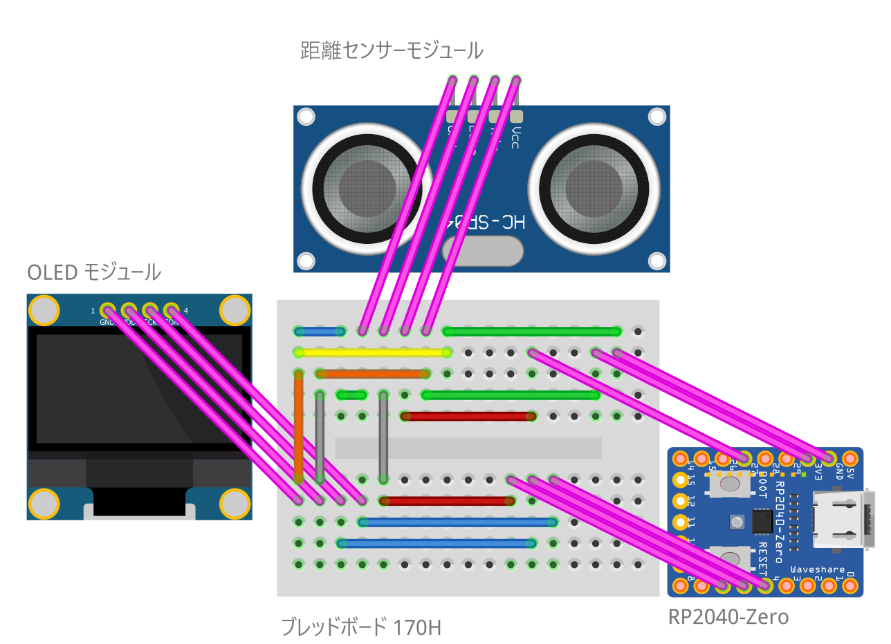

# Arduino: RP2040-Rangefinder

コンパクトな超音波測距計です。

## 部材

| 種別 | 型番など | 数量 |
|:-----|:---------|:-----|
| ブレッドボード | 170H | 1個 |
| ジャンパーワイヤ | - | 13本 |
| マイコン | RP2040-Zero | 1個 |
| OLED モジュール | 0.91" 128x32 SSD1306 | 1個 |
| 超音波距離センサー | HC-SR04 | 1個 |

## 接続

### OLED ディスプレイ

| OLED モジュール | RP2040-Zero |
|:---|:---|
| VCC | 3.3V |
| GND | GND |
| SDA | GPIO 4 (SDA) |
| SCL | GPIO 5 (SCL) |

### 超音波距離センサー

| 超音波距離センサー | RP2040-Zero |
|:---|:---|
| VCC | 5V |
| GND | GND |
| Trig | GPIO 27 |
| Echo | GPIO 6 |

## 配線図

## 開発環境

### 統合開発環境

| ソフトウェア | 説明 |
|:-----------|:-----|
| Arduino IDE | 統合開発環境 |

**インストール**: 公式サイト [https://www.arduino.cc/en/software/#ide](https://www.arduino.cc/en/software/#ide) からダウンロード・インストール

### ボードサポート

| ボード | 説明 |
|:------|:-----|
| Raspberry Pi RP2040 Boards | RP2040-Zero 開発 |

**インストール**: Arduino IDE のボードマネージャーで検索・インストール

### 依存ライブラリ

| ライブラリ | 説明 |
|:-----------|:-----|
| Adafruit SSD1306 | SSD1306 OLEDディスプレイ制御 |

**インストール**: Arduino IDE のライブラリマネージャーで検索・インストール

## 操作

マイコンに電源を供給すると作動します。
定期的に距離を計測して、OLED に表示します。

## ライセンス

このプロジェクトは [MIT ライセンス](./LICENSE) の下で公開されています。
自由に使用、改変、再配布していただけます。
